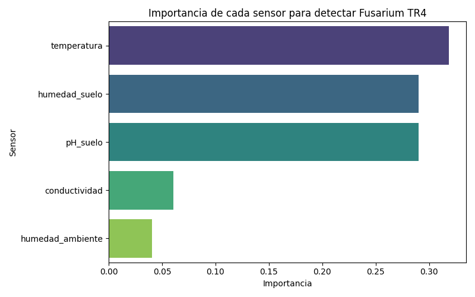
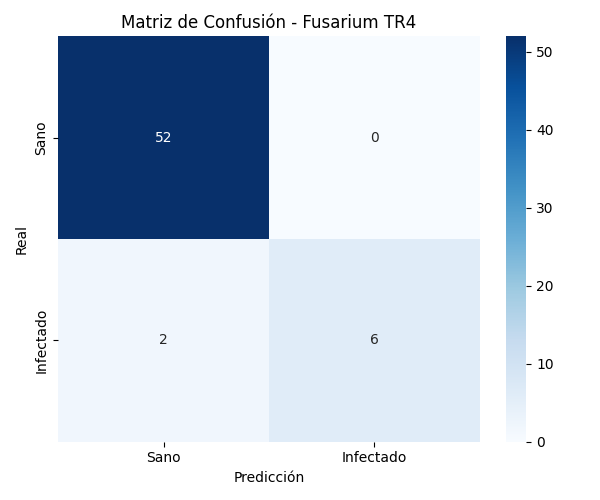
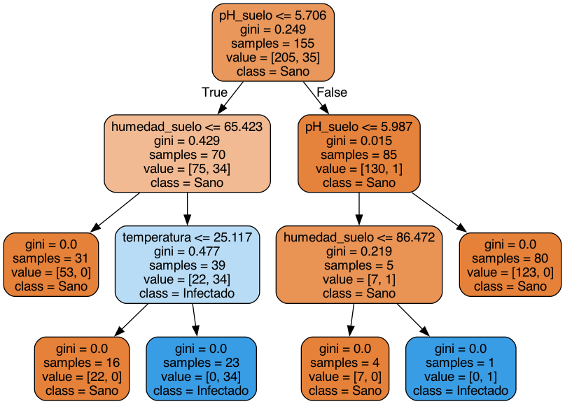

# Detección de Fusarium TR4 con Random Forest

Sistema de clasificación basado en **Random Forest** para detectar zonas de cultivo de banano y plátano en riesgo de infección por *Fusarium oxysporum* cubense Raza Tropical 4 (TR4), una de las amenazas fitosanitarias más graves para los cultivos latinoamericanos.

---

## ¿Qué es este proyecto?

Este proyecto simula un sistema de monitoreo agrícola inteligente que analiza datos de **sensores de suelo y ambiente** para predecir si una zona de cultivo está en riesgo de infección por Fusarium TR4.

Se desarrolló como ejemplo práctico del modelo **Random Forest** en el contexto de ensambles estadísticos en Machine Learning.

---

## ¿Por qué Fusarium TR4?

El hongo *Fusarium oxysporum* cubense TR4 representa una amenaza crítica para la industria bananera colombiana y latinoamericana:

- Colombia detectó TR4 en 2019 en La Guajira
- Amenaza las 584.000 ha de banano y plátano sembradas en el país
- Persiste en el suelo por décadas sin posibilidad de erradicación
- La detección temprana es clave para evitar pérdidas millonarias

---

## ¿Cómo funciona?

El modelo analiza **5 variables de sensores** por zona de cultivo:

| Sensor | Descripción |
|---|---|
| `pH_suelo` | Acidez del suelo (4.5 - 7.5) |
| `humedad_suelo` | Humedad del suelo en % (30 - 95%) |
| `temperatura` | Temperatura del suelo en °C (18 - 35°C) |
| `conductividad` | Conductividad eléctrica del suelo |
| `humedad_ambiente` | Humedad relativa del ambiente (40 - 100%) |

Y predice si la zona está sana o infectada, junto con la probabilidad de infección.

---

## Resultados del modelo

El modelo alcanza un **97% de accuracy** sobre datos de prueba.

| Métrica | Sano | Infectado |
|---|---|---|
| Precision | 0.96 | 1.00 |
| Recall | 1.00 | 0.75 |
| F1-score | 0.98 | 0.86 |

### Importancia de cada sensor



La **temperatura**, **humedad del suelo** y **pH** son los factores más determinantes para la detección del hongo, resultado consistente con la biología del TR4, que prospera en suelos cálidos, húmedos y ácidos.

### Matriz de confusión



### Árbol de decisión (primer árbol del bosque)



---

## Requisitos

| Tipo | Paquete / herramienta |
|---|---|
| **Python** | 3.10 o superior |
| **pip** (Python) | Ver `requirements.txt` |
| **Sistema** | [Graphviz](https://graphviz.org/) — necesario para exportar el árbol a `arbol.png` |

> **Nota:** Graphviz no se instala con `pip`. Es un programa del sistema cuyo comando `dot` usa el script al final de la ejecución.

---

## Cómo ejecutarlo

### 1. Clonar el repositorio

```bash
git clone https://github.com/sebasvcx/Fusarium-Random-Forest.git
cd Fusarium-Random-Forest
```

### 2. Crear entorno virtual e instalar dependencias de Python

#### macOS

```bash
python3 -m venv venv
source venv/bin/activate
pip install -r requirements.txt
```

Instalar Graphviz (elige una opción):

```bash
# Con Homebrew (recomendado)
brew install graphviz
```

#### Windows

En **PowerShell** o **CMD**:

```powershell
python -m venv venv
venv\Scripts\activate
pip install -r requirements.txt
```

Instalar Graphviz (elige una opción):

- **Con winget:** `winget install Graphviz.Graphviz`
- **Con Chocolatey:** `choco install graphviz`
- **Manual:** descarga el instalador desde [graphviz.org/download](https://graphviz.org/download/) y reinicia la terminal

Después de instalar Graphviz en Windows, verifica que el comando funcione:

```powershell
dot -V
```

Si `dot` no se reconoce, agrega la carpeta `bin` de Graphviz al **PATH** del sistema (suele ser `C:\Program Files\Graphviz\bin`).

### 3. Ejecutar el script

Con el entorno virtual **activado**:

| Sistema | Comando |
|---|---|
| **macOS** | `python3 fusarium_rf.py` |
| **Windows** | `python fusarium_rf.py` |

### 4. Salida esperada

Al terminar, el script muestra en consola:

- Muestra de los datos simulados
- Reporte de clasificación (precision, recall, F1)
- Importancia de cada sensor
- Predicción de una zona nueva de ejemplo

Y genera estos archivos en la carpeta del proyecto:

| Archivo | Descripción |
|---|---|
| `feature_importance.png` | Barras de importancia por sensor |
| `confusion_matrix.png` | Matriz de confusión del modelo |
| `arbol.dot` | Definición del árbol en formato Graphviz |
| `arbol.png` | Visualización del primer árbol del bosque |

---

## Estructura del proyecto

```
Fusarium-Random-Forest/
├── fusarium_rf.py           # Código principal
├── requirements.txt         # Dependencias de Python
├── feature_importance.png   # Gráfica de importancia de sensores
├── confusion_matrix.png     # Matriz de confusión
├── arbol.dot                # Árbol en formato Graphviz (generado al ejecutar)
├── arbol.png                # Visualización del árbol (generado al ejecutar)
└── README.md
```

---

## Tecnologías

- Python 3.x
- NumPy
- pandas
- scikit-learn
- matplotlib
- seaborn
- Graphviz (exportación del árbol de decisión)

---

## Solución de problemas

| Problema | Solución |
|---|---|
| `python` o `python3` no encontrado | Instala Python desde [python.org](https://www.python.org/downloads/). En Windows, marca **"Add Python to PATH"** durante la instalación. |
| `dot: command not found` | Instala Graphviz (ver paso 2) y reinicia la terminal. |
| Las ventanas de gráficas no aparecen | Es normal si usas un entorno sin pantalla; los archivos `.png` se guardan igual en la carpeta del proyecto. |
| Error al activar `venv` en Windows | Ejecuta `Set-ExecutionPolicy -Scope CurrentUser RemoteSigned` en PowerShell (solo una vez) y vuelve a activar con `venv\Scripts\activate`. |

---

## Contexto académico

Proyecto desarrollado para la asignatura **Introducción a la Inteligencia Artificial** como demostración práctica del modelo **Random Forest** dentro de los métodos de ensamble estadístico en Machine Learning.
